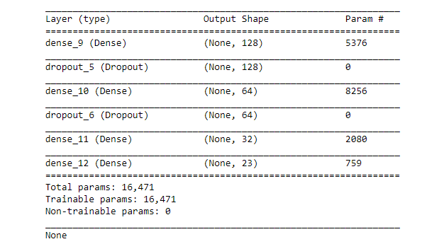

<h1>      Network-Intrusion-Detector </h1>

**<h2>Problem Statement:</h2>** 
The task for the classifier learning contest organized in conjunction with the KDD'99 conference was to learn a predictive model (i.e. a classifier) capable of distinguishing between legitimate and illegitimate connections in a computer network.  Here is a [detailed description](http://kdd.ics.uci.edu/databases/kddcup99/task.html) of the task.  

The training and test data were generously made available by Prof. Sal Stolfo of Columbia University and Prof. Wenke Lee of North Carolina State University.  (Update: The training and test datasets are now [available](http://kdd.ics.uci.edu/databases/kddcup99/kddcup99.html) in the UC Irvine KDD archive.)

<h2>Dataset:</h2> 
The data used here in this project is a 10% stratified subsample of the data from the 1999 ACM KDD Cup. It can be downloaded from [here](http://kdd.ics.uci.edu/databases/kddcup99/kddcup.data_10_percent.gz). It contains 494020 instances with 42 features. A complete listing of the set of features defined for the connection records is given in the three tables below:  

&nbsp;
&nbsp;
<TABLE BORDER WIDTH="80%" NOSAVE >
<TR NOSAVE>
<TD><I>feature name</I></TD>

<TD NOSAVE><I>description&nbsp;</I></TD>

<TD><I>type</I></TD>
</TR>

<TR>
<TD>duration&nbsp;</TD>

<TD>length (number of seconds) of the connection&nbsp;</TD>

<TD>continuous</TD>
</TR>

<TR>
<TD>protocol_type&nbsp;</TD>

<TD>type of the protocol, e.g. tcp, udp, etc.&nbsp;</TD>

<TD>discrete</TD>
</TR>

<TR>
<TD>service&nbsp;</TD>

<TD>network service on the destination, e.g., http, telnet, etc.&nbsp;</TD>

<TD>discrete</TD>
</TR>

<TR>
<TD>src_bytes&nbsp;</TD>

<TD>number of data bytes from source to destination&nbsp;</TD>

<TD>continuous</TD>
</TR>

<TR>
<TD>dst_bytes&nbsp;</TD>

<TD>number of data bytes from destination to source&nbsp;</TD>

<TD>continuous</TD>
</TR>

<TR>
<TD>flag&nbsp;</TD>

<TD>normal or error status of the connection&nbsp;</TD>

<TD>discrete&nbsp;</TD>
</TR>

<TR>
<TD>land&nbsp;</TD>

<TD>1 if connection is from/to the same host/port; 0 otherwise&nbsp;</TD>

<TD>discrete</TD>
</TR>

<TR>
<TD>wrong_fragment&nbsp;</TD>

<TD>number of ``wrong'' fragments&nbsp;</TD>

<TD>continuous</TD>
</TR>

<TR>
<TD>urgent&nbsp;</TD>

<TD>number of urgent packets&nbsp;</TD>

<TD>continuous</TD>
</TR>

<CAPTION ALIGN=BOTTOM>&nbsp;
 Table 1: Basic features of individual TCP connections.</CAPTION>
</TABLE>
&nbsp;
<TABLE BORDER WIDTH="80%" NOSAVE >
<TR>
<TD><I>feature name</I></TD>

<TD><I>description&nbsp;</I></TD>

<TD><I>type</I></TD>
</TR>

<TR>
<TD>hot&nbsp;</TD>

<TD>number of ``hot'' indicators</TD>

<TD>continuous</TD>
</TR>

<TR>
<TD>num_failed_logins&nbsp;</TD>

<TD>number of failed login attempts&nbsp;</TD>

<TD>continuous</TD>
</TR>

<TR>
<TD>logged_in&nbsp;</TD>

<TD>1 if successfully logged in; 0 otherwise&nbsp;</TD>

<TD>discrete</TD>
</TR>

<TR>
<TD>num_compromised&nbsp;</TD>

<TD>number of ``compromised'' conditions&nbsp;</TD>

<TD>continuous</TD>
</TR>

<TR>
<TD>root_shell&nbsp;</TD>

<TD>1 if root shell is obtained; 0 otherwise&nbsp;</TD>

<TD>discrete</TD>
</TR>

<TR>
<TD>su_attempted&nbsp;</TD>

<TD>1 if ``su root'' command attempted; 0 otherwise&nbsp;</TD>

<TD>discrete</TD>
</TR>

<TR>
<TD>num_root&nbsp;</TD>

<TD>number of ``root'' accesses&nbsp;</TD>

<TD>continuous</TD>
</TR>

<TR>
<TD>num_file_creations&nbsp;</TD>

<TD>number of file creation operations&nbsp;</TD>

<TD>continuous</TD>
</TR>

<TR>
<TD>num_shells&nbsp;</TD>

<TD>number of shell prompts&nbsp;</TD>

<TD>continuous</TD>
</TR>

<TR>
<TD>num_access_files&nbsp;</TD>

<TD>number of operations on access control files&nbsp;</TD>

<TD>continuous</TD>
</TR>

<TR NOSAVE>
<TD>num_outbound_cmds</TD>

<TD NOSAVE>number of outbound commands in an ftp session&nbsp;</TD>

<TD>continuous</TD>
</TR>

<TR>
<TD>is_hot_login&nbsp;</TD>

<TD>1 if the login belongs to the ``hot'' list; 0 otherwise&nbsp;</TD>

<TD>discrete</TD>
</TR>

<TR>
<TD>is_guest_login&nbsp;</TD>

<TD>1 if the login is a ``guest''login; 0 otherwise&nbsp;</TD>

<TD>discrete</TD>
</TR>

<CAPTION ALIGN=BOTTOM>&nbsp;
 Table 2: Content features within a connection suggested by domain knowledge.</CAPTION>
</TABLE>
&nbsp;
<TABLE BORDER WIDTH="80%" NOSAVE >
<TR>
<TD><I>feature name</I></TD>

<TD><I>description&nbsp;</I></TD>

<TD><I>type</I></TD>
</TR>

<TR>
<TD>count&nbsp;</TD>

<TD>number of connections to the same host as the current connection in
the past two seconds&nbsp;</TD>

<TD>continuous</TD>
</TR>

<TR>
<TD></TD>

<TD><I>Note: The following&nbsp; features refer to these same-host connections.</I></TD>

<TD></TD>
</TR>

<TR>
<TD>serror_rate&nbsp;</TD>

<TD>% of connections that have ``SYN'' errors&nbsp;</TD>

<TD>continuous</TD>
</TR>

<TR>
<TD>rerror_rate&nbsp;</TD>

<TD>% of connections that have ``REJ'' errors&nbsp;</TD>

<TD>continuous</TD>
</TR>

<TR>
<TD>same_srv_rate&nbsp;</TD>

<TD>% of connections to the same service&nbsp;</TD>

<TD>continuous</TD>
</TR>

<TR>
<TD>diff_srv_rate&nbsp;</TD>

<TD>% of connections to different services&nbsp;</TD>

<TD>continuous</TD>
</TR>

<TR>
<TD>srv_count&nbsp;</TD>

<TD>number of connections to the same service as the current connection
in the past two seconds&nbsp;</TD>

<TD>continuous</TD>
</TR>

<TR>
<TD></TD>

<TD><I>Note: The following features refer to these same-service connections.</I></TD>

<TD></TD>
</TR>

<TR>
<TD>srv_serror_rate&nbsp;</TD>

<TD>% of connections that have ``SYN'' errors&nbsp;</TD>

<TD>continuous</TD>
</TR>

<TR>
<TD>srv_rerror_rate&nbsp;</TD>

<TD>% of connections that have ``REJ'' errors&nbsp;</TD>

<TD>continuous</TD>
</TR>

<TR>
<TD>srv_diff_host_rate&nbsp;</TD>

<TD>% of connections to different hosts&nbsp;</TD>

<TD>continuous&nbsp;</TD>
</TR>

<CAPTION ALIGN=BOTTOM>&nbsp;
 Table 3: Traffic features computed using a two-second time window.</CAPTION>
</TABLE>
&nbsp;

<h2>Approach:</h2>

In this project a deep neural network was used with followig specification:
* number of layers: 4
* Architecture: Dense(128)=> Relu=> Dense(64)=> Relu=> Dense(32)=> Relu=> Dense(23)=> softmax
* Optimiser: RMS with learning rate=0.001, rho=0.9, epsilon=None, decay=0

<h2>Results:</h2>

* The training accuracy achieved was: 99.1%  
* The test accuracy achieved was    : 99.1%
